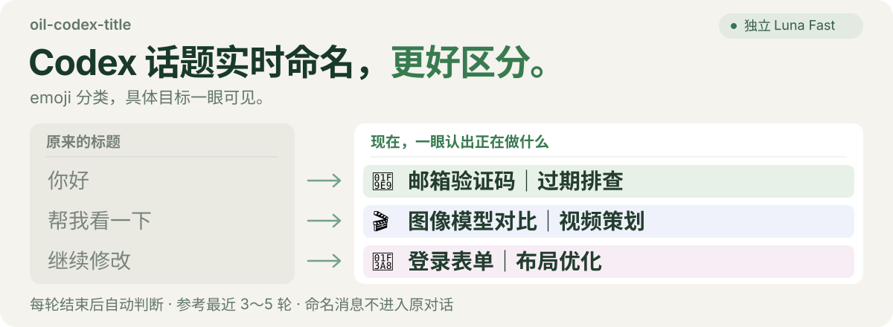

# oil-codex-title

<p align="center">
  
</p>

一个 Codex 本地插件：每轮对话结束后，用独立的 **Luna Fast** 判断是否更新任务标题。参考最近 3～5 轮有效对话，让侧边栏里留下“哪个对象、正在做什么”。

**预览版。** 这里的“实时”指每轮对话结束后在后台判断，并非逐字即时更新。标题元数据写入已验证；部分桌面版本的置顶列表可能继续显示旧缓存，后台自动刷新尚未验证。详见[兼容性与发布状态](docs/发布验收.md)。

## 有很多任务，也能认出这一条

下面是合成项目示例，展示命名规则，不是用户真实对话。

| 容易混淆的名称 | 更容易找回的名称 |
| --- | --- |
| 回应中文问候 | 🛠️ 邮箱验证码过期排查 |
| 确认注册功能 | 🛠️ 支付回调重复发货修复 |
| 讨论视频标题 | 🎬 Orion 图像模型评测视频策划 |
| 继续推送 | 🛠️ 支付回调幂等修复 |

emoji 用来扫视分类，**模块、内容对象与具体目标负责区分任务**。提交、测试和“继续”通常延续已有工作，不会自动取代主线；用户明确转向新的工作时，标题随之更新。

外层已有项目名时，标题默认省略重复的项目名。只有 monorepo 子项目、从上级目录操作具体项目，或跨项目任务需要消除歧义时才保留。模型名、公司名与视频主题仍按内容需要保留。

## 一轮结束，后台判断

<p align="center">
  
</p>

- **独立运行**：临时模型会话不恢复原任务，也不向原对话追加命名消息。
- **减少误改**：写入前复查内容与标题；过期结果丢弃。外部改名保护从首次成功评估后开始。
- **可随时控制**：支持预览、暂停、恢复和锁定。重名检查基于同一工作目录中已记录的任务，不保证全局唯一。

## 本地开始使用

需要 **Python 3.10+**、已登录且支持 Hook 的 Codex，以及能够读取当前桌面存储格式的 CLI。macOS 已实测；Linux 未实机验证，Windows 与云端暂不支持。

直接把下面这段话发给 Codex，让它查找仓库并完成安装：

```text
帮我查找 GitHub 仓库 oil-oil/oil-codex-title，下载并使用 plugin-creator 安装为完整的 Codex 插件（包含 Stop Hook，不要只安装 Skill）。请完成本地插件市场配置、启用 Hook，并运行 doctor 检查；如果需要我在界面中信任 Hook，请告诉我具体操作。
```

在 Codex 的 `/hooks` 或 Hook 管理入口检查并信任本插件的 Stop Hook，然后在一个新任务里验证。安装、启用、信任、实际触发、桌面显示是不同的检查项。

在插件目录中运行：

```sh
python3 scripts/oil_codex_title.py doctor
python3 scripts/oil_codex_title.py rename <任务ID>          # 预览
python3 scripts/oil_codex_title.py rename <任务ID> --apply  # 写入并读回核验
```

默认是 `gpt-5.6-luna`、低推理、Fast 服务档位。复用 Codex 登录，消耗该账号的模型额度，无需另存 API Key。可[调整模型与档位](docs/使用与边界.md#控制方式)。

## 你来控制

| 想做什么 | 对 Codex 说 |
| --- | --- |
| 看看候选标题 | 预览这个任务的新标题 |
| 固定手工名称 | 固定这个任务的标题 |
| 暂时停止 | 暂停自动命名 |
| 重新启用 | 恢复自动命名 |
| 置顶仍显示旧标题 | 检查真实标题并同步桌面显示 |

最后一项由主 Agent 使用宿主的标题工具执行。当前后台 Hook 不能保证刷新所有桌面置顶缓存；`renamed` 只表示元数据写入并核验成功。

## 数据留在哪里

配置与简短日志保存在 `$CODEX_HOME/oil-codex-title`。对话摘录只交给当前 Codex 登录使用的模型服务；插件不持久保存完整对话或模型提示词，临时输出用完删除。日志包含标题、理由和用量。详见[数据与并发边界](docs/使用与边界.md#数据与并发边界)。

## 开发与验证

```sh
python3 -m unittest discover -s tests -v
python3 scripts/evaluate_naming.py         # 只查看案例数量，不调用模型
python3 scripts/evaluate_naming.py --live  # 用 Luna Fast 实测，会消耗额度
```

[合成案例](tests/fixtures/naming_cases.json)覆盖主线延续、主题转移、项目区分、同组标题冲突、monorepo 与提示注入。评测结果只说明这组案例的表现，不代表普遍准确率，也不代替真实桌面验收。

[详细使用](docs/使用与边界.md) · [命名与回归规范](docs/命名与回归规范.md) · [发布验收](docs/发布验收.md)

## 许可证

[MIT](LICENSE)。
